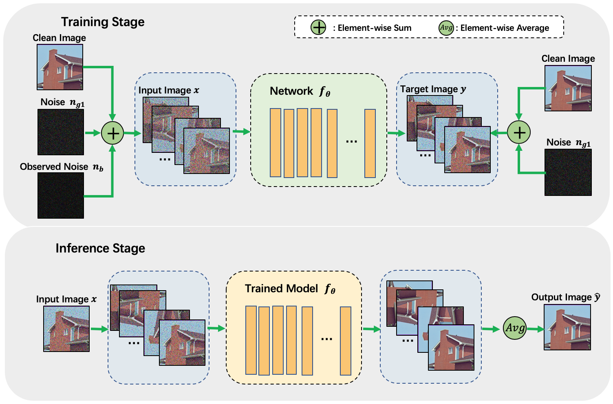

 # Unsupervised Boosting of Supervised DenoisingNetworks for Realistic Noise Removal

In this repository we provide:

> **NACPA strategy applied on four denoising methods**

> training code and test code test sets

> Yuan Huang, Jun Xu, Li Liu, Fan Zhu, Ling Shao, Xingsong Hou, Wangmeng Zuo


[[paper]](https://paper.pdf) [[supmat]](supp.pdf)



Here we provide hyperparameters and architectures, that were used to generate the figures. Most of them are far from optimal. Do not hesitate to change them and see the effect.


# Install

Here is the list of libraries you need to install to execute the code:
- python = 3.6
- [pytorch](http://pytorch.org/) = 0.4 or later version
- numpy
- scipy
- matplotlib
- scikit-image


## Performance on realistic noise removal
|        |       | DND|| SIDD Val|| SIDD Benchmark||

| Method | U./S. | PSNR | SSIM   | PSNR | SSIM   |  PSNR| SSIM   |
|:------------:|:-----:|:----:|:------:|:----:|:------:|:----:|:------:|
|CBM3D         |   U.  | 34.51| 0.8507 | 30.88| 0.7025 |25.65 |0.6850  |
|N2N           |   U.  | 33.10| 0.8110 | 24.27| 0.3527 |24.50 |0.5050  |
|GCBD          |   U.  | 35.58| 0.9217 |   -  | -      |-     |-       |
|CDnCNN        |   S.  | 37.21| 0.9297 | 36.36| 0.8858 |36.61 | 0.9270 |
|CDnCNN+NAC    |   U.  | 33.32| 0.8159 |27.81 |0.5287  | 27.86| 0.6660 |
|CDnCNN+NACPA  |   U.  |36.16 |0.9003  |32.39 |0.7273  |32.42 |0.8260  |
|RCAN*         | S.    | 35.89|  0.9128| 34.91|0.8278  | 34.90|0.9000  |
|RCAN*+NAC     | U.    |33.62 |0.8237  |28.60 |0.5431  |28.55 |0.6870  |
|RCAN*+NACPA   | U.    |36.10 |0.9104  |31.69 |0.6945  | 31.51|0.8090  | 


# Citation
```

```
